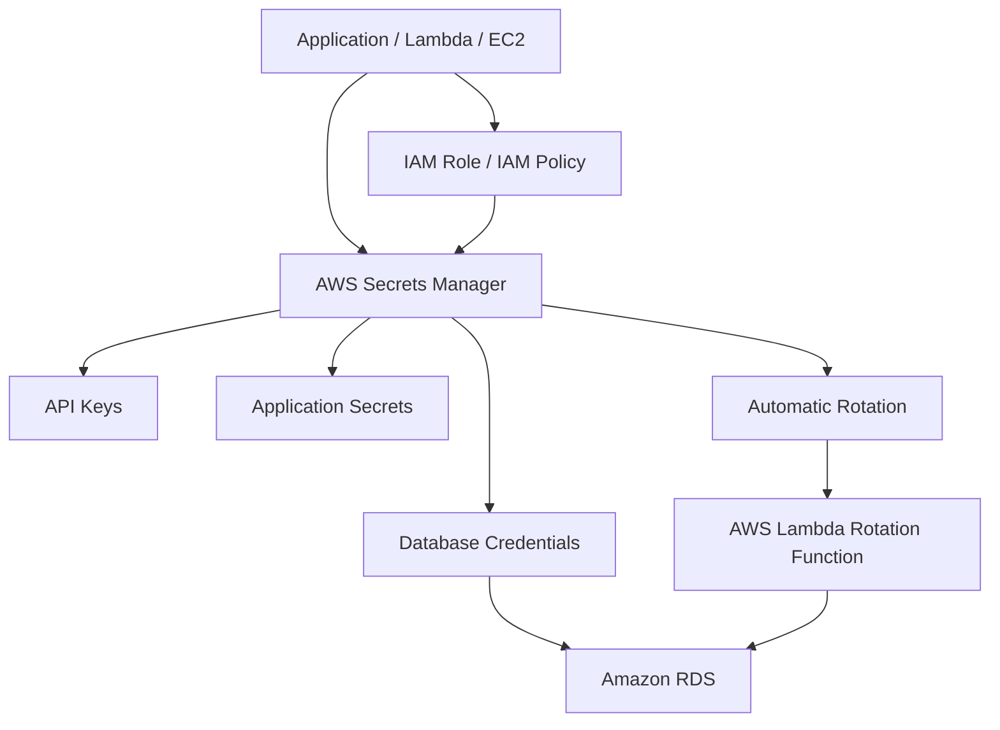

# AWS Secrets Manager for Secure Credential Storage

## Overview

This project demonstrates how to securely store and manage sensitive credentials such as **database usernames**, **passwords**, **API keys**, and **application secrets** using **AWS Secrets Manager**.

The solution eliminates hardcoded credentials, enables automated secret rotation, and provides secure access through IAM policies, significantly improving cloud security and compliance.

---

# Architecture Diagram



---

# High-Level Architecture

```text
Application / EC2 / Lambda
          │
          ▼
IAM Role / IAM Policy
          │
          ▼
AWS Secrets Manager
          │
 ┌────────┼─────────┐
 │        │         │
 ▼        ▼         ▼
DB Credentials API Keys App Secrets
          │
          ▼
Amazon RDS
          │
          ▼
Automatic Secret Rotation
          │
          ▼
Lambda Function
```

---

# Solution Workflow


