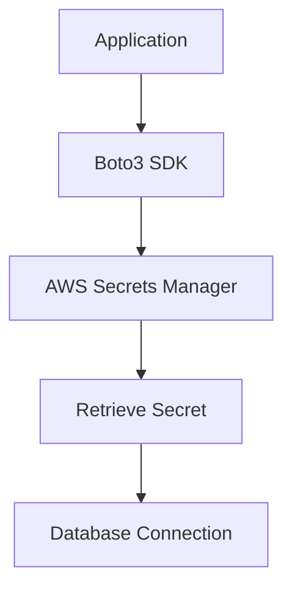
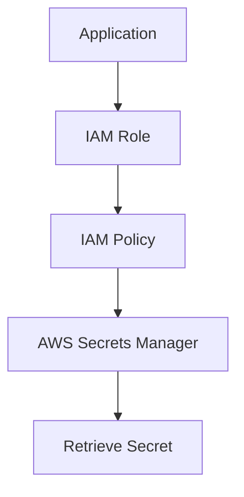
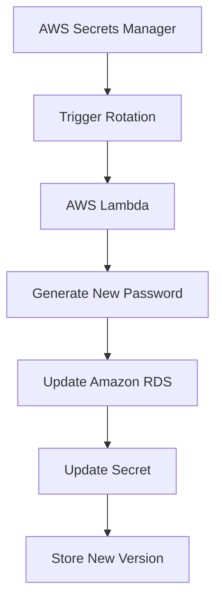
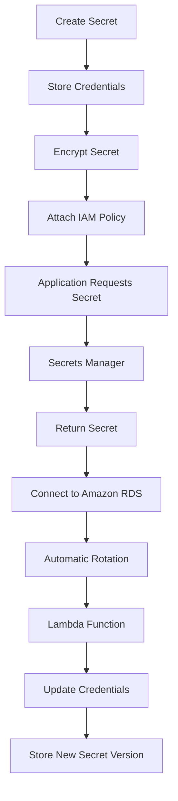

# Step 1: Create a Secret in AWS Secrets Manager

## Navigation

```text
AWS Console
    │
    ▼
AWS Secrets Manager
    │
    ▼
Store a New Secret
```

## Secret Configuration

| Setting | Value |
|----------|----------|
| Secret Type | Credentials for RDS Database |
| Username | Database Username |
| Password | Database Password |
| Target Service | Amazon RDS (Optional) |

---

## Secret Creation Workflow

```text
AWS Secrets Manager
        │
        ▼
Store New Secret
        │
        ▼
Enter Credentials
        │
        ▼
Save Secret
```

---

# Step 2: Configure Secret Settings

## Secret Details

| Configuration | Value |
|--------------|---------|
| Secret Name | mydb-credentials |
| Description | Database Credential Storage |
| Rotation | Optional |
| Rotation Service | AWS Lambda |

---

## Secret Storage Workflow

```text
Database Credentials
        │
        ▼
AWS Secrets Manager
        │
        ▼
Encrypted Storage
```

---

# Step 3: Retrieve Secret Using AWS CLI

## AWS CLI Command

```bash
aws secretsmanager get-secret-value \
--secret-id mydb-credentials
```

---

## Sample Output

```json
{
  "username": "admin",
  "password": "********"
}
```

---

# Step 4: Retrieve Secret Using AWS SDK (Python Boto3)

## Python Example

```python
import boto3
import json

client = boto3.client(
    'secretsmanager',
    region_name='us-east-1'
)

response = client.get_secret_value(
    SecretId='mydb-credentials'
)

secret = json.loads(
    response['SecretString']
)

db_username = secret['username']
db_password = secret['password']

print(f"DB User: {db_username}")
```

---

## Application Access Flow



---

# Step 5: Grant IAM Permissions

## Navigation

```text
AWS Console
    │
    ▼
IAM
    │
    ▼
Policies
```

---

## IAM Policy

```json
{
  "Version": "2012-10-17",
  "Statement": [
    {
      "Effect": "Allow",
      "Action": [
        "secretsmanager:GetSecretValue"
      ],
      "Resource": "arn:aws:secretsmanager:us-east-1:123456789012:secret:mydb-credentials"
    }
  ]
}
```

---

## Permissions Granted

| Permission | Purpose |
|------------|----------|
| GetSecretValue | Read Secret |
| DescribeSecret | View Metadata |
| ListSecrets | View Available Secrets |

---

# IAM Access Architecture



---

# Step 6: Integrate Secrets Manager with Amazon RDS

## RDS Integration

| Service | Purpose |
|----------|----------|
| Amazon RDS | Database Hosting |
| Secrets Manager | Credential Storage |
| Lambda | Password Rotation |

---

## RDS Workflow

```text
Amazon RDS
      │
      ▼
Database Credentials
      │
      ▼
AWS Secrets Manager
      │
      ▼
Secure Application Access
```

---

# Step 7: Enable Automatic Secret Rotation

## Components

| Component | Function |
|------------|-----------|
| AWS Secrets Manager | Manage Secrets |
| AWS Lambda | Rotate Passwords |
| Amazon RDS | Update Database Credentials |
| IAM Role | Permission Management |

---

## Rotation Process



---

# End-to-End Workflow



---

# Security Best Practices Implemented

## Secrets Management

| Control | Status |
|----------|----------|
| Secure Secret Storage | Implemented |
| Encryption at Rest | Implemented |
| Encryption in Transit | Implemented |
| Automatic Rotation | Implemented |
| IAM-Based Access | Implemented |

---

## Credential Security

| Security Practice | Benefit |
|-------------------|----------|
| No Hardcoded Credentials | Reduced Risk |
| Centralized Secret Storage | Easier Management |
| Fine-Grained Access Control | Improved Security |
| Automated Rotation | Compliance Readiness |

---

## Compliance Controls

| Requirement | Benefit |
|-------------|----------|
| Auditability | Full Access Tracking |
| Least Privilege | Reduced Attack Surface |
| Credential Lifecycle Management | Enhanced Governance |
| Security Framework Alignment | AWS Best Practices |

---

# Validation Checklist

| Validation Item | Status |
|-----------------|---------|
| Secret Created | ✅ |
| Secret Stored Securely | ✅ |
| IAM Policy Configured | ✅ |
| Secret Retrieved via CLI | ✅ |
| Secret Retrieved via SDK | ✅ |
| Application Access Verified | ✅ |
| RDS Integration Completed | ✅ |
| Secret Rotation Enabled | ✅ |

---

# Project Outcome

Successfully implemented AWS Secrets Manager to securely manage database credentials and API keys while eliminating hardcoded secrets. The solution improves security posture through encryption, IAM-based access control, and automated credential rotation.

---

# Impact

- Eliminated hardcoded credentials from applications.
- Improved cloud security posture.
- Reduced credential exposure risks.
- Enhanced compliance and governance.
- Automated credential lifecycle management.
- Simplified secure access to databases and APIs.
- Improved operational efficiency through automated rotation.

---

# Technologies Used

| Category | Technology |
|------------|------------|
| Cloud Platform | AWS |
| Secret Management | AWS Secrets Manager |
| Database | Amazon RDS |
| Serverless | AWS Lambda |
| Identity Management | AWS IAM |
| SDK | Python Boto3 |
| CLI | AWS CLI |
| Security | IAM Policies |
| Compliance | Credential Governance |
| Encryption | AWS KMS |
